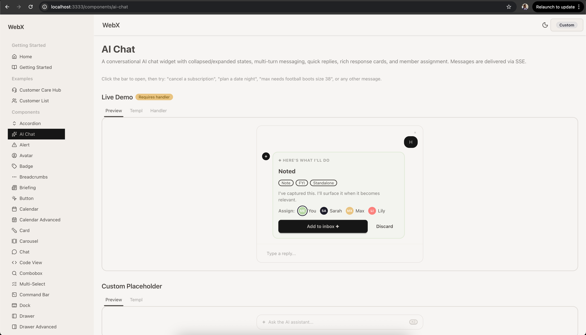

# dsx

A server-rendered component framework for Go. Built on [Templ](https://templ.guide), [DaisyUI](https://daisyui.com), and [Datastar](https://data-star.dev).

```
Browser                          Server (Go)
  |                                |
  |  GET /page ------------------>|  templ renders HTML
  |<---- full HTML page ----------|
  |                                |
  |  SSE @get('/fragment') ------>|  handler returns SSE events
  |<---- patch DOM element -------|  (PatchElements, PatchSignals)
  |                                |
  |  SSE stream /stream --------->|  stream.Relay listens to pub/sub
  |<---- per-domain signal -------|  component reacts by action
```

## Why dsx

- **Server-side rendering** with Go and Templ. No Node.js build step.
- **~15KB of JavaScript** total. Datastar handles all frontend interactivity.
- **70+ pre-built components** styled with DaisyUI. Accordions to YAML trees.
- **Real-time updates** across all browser tabs via pub/sub-backed SSE streaming.
- **Type-safe Datastar** helpers. No string typos in `data-on:click` attributes.
- **You own the code.** Fork it, edit it, ship it. No versioning conflicts.




## Quick start

```bash
# Prerequisites: Go 1.24+

# Install dependencies
go tool task install:all

# Generate templ + build Tailwind CSS
go tool templ generate
go tool gotailwind

# Run the showcase
go run ./cmd/showcase
```

Open [http://localhost:3333](http://localhost:3333) to browse all components.

## Architecture

```
┌──────────────────────────────────────────────────────────────┐
│  dsx                                                         │
│                                                              │
│  ui/           70+ DaisyUI components (templ)                │
│  ds/           Type-safe Datastar helpers (frontend + SSE)   │
│  stream/       Reactive SSE relay backed by pub/sub          │
│  layouts/      Base HTML + Dashboard layout                  │
│  utils/        TwMerge, If, RandomID                         │
│  showcase/     Reusable dev server with identity switching   │
│                                                              │
│  External:                                                   │
│  pubsub        Pub/sub interface + adapters (NATS/Redis/Chan)│
│  identity      Multi-tenant identity context                 │
└──────────────────────────────────────────────────────────────┘
```

## Core packages

### `dsx` — Context and middleware

Every request carries a `dsx.Context` with session, CSRF, theme, and stream state.

```go
import "github.com/laenen-partners/dsx"

r := chi.NewRouter()

// Session + CSRF middleware (cookie-based, no session store needed)
r.Use(dsx.Middleware(dsx.MiddlewareConfig{
    Secret: secret, // 32-byte HMAC key
    Secure: true,   // HTTPS-only cookies
}))
r.Use(dsx.SecurityHeadersMiddleware())
```

Access in handlers:

```go
func handler(w http.ResponseWriter, r *http.Request) {
    ctx := dsx.FromContext(r.Context())
    ctx.SessionID  // unique per browser
    ctx.CSRFToken  // signed double-submit token
    ctx.Theme      // current DaisyUI theme
    ctx.BasePath   // e.g. "/app"
    ctx.APIPath("/customers/list") // → "/app/customers/list"
}
```

### `ds` — Datastar helpers

Type-safe helpers for Datastar attributes and SSE operations. Prevents common mistakes like `data-on-click` (wrong) vs `data-on:click` (correct).

#### Frontend attributes

```go
import "github.com/laenen-partners/dsx/ds"

// Event handlers
ds.OnClick(ds.Post("/api/save"))     // data-on:click="@post('/api/save', ...)"
ds.On("keydown", "$value = ''")      // data-on:keydown="$value = ''"

// Data binding
ds.Bind("form1", "email")            // data-bind:form1.email

// Display
ds.Show("$isVisible")                // data-show="$isVisible"
ds.Text("$count + ' items'")         // data-text="$count + ' items'"
ds.ClassToggle("active", "$isOn")    // data-class:active="$isOn"

// Initialization
ds.Init(ds.GetOnce("/api/data"))      // data-init="@get('/api/data')"

// Merge multiple attribute maps
ds.Merge(ds.OnClick(expr), ds.Show("$open"))
```

#### SSE backend operations

```go
// Read form signals from request
var signals MyForm
ds.ReadSignals("form-id", r, &signals)

// Patch a templ component into the DOM
ds.Send.Patch(sse, myComponent(data))

// UI feedback
ds.Send.Toast(sse, ds.ToastSuccess, "Saved!")
ds.Send.Drawer(r.Context(), sse, editForm(item))
ds.Send.Modal(r.Context(), sse, confirmDialog())
ds.Send.Confirm(sse, "Delete this?", "/api/delete/42")
ds.Send.HideDrawer(sse)
ds.Send.HideModal(sse)
ds.Send.Redirect(sse, "/dashboard")
ds.Send.Download(sse, "/files/report.pdf", "report.pdf")
```

### `stream` — DOM-driven watch subscriptions

See the [Real-Time Reactive UIs](#real-time-reactive-uis) section below for full details, concepts, and examples.

### `layouts` — Page layouts

```go
import "github.com/laenen-partners/dsx/layouts"

// Base layout provides HTML shell with all required containers
templ MyPage() {
    @layouts.Base(layouts.BaseProps{
        Title:     "My App",
        Theme:     "silk",
        CSRFToken: dsxCtx.CSRFToken,
        Head:      myHead(),
    }) {
        // page content
    }
}
```

The Base layout includes containers for SSE-driven UI:

```
<head>
    <meta name="stream-url">  ← watch worker reads stream endpoint URL
</head>
<body>
    { children }              ← your page content
    <div id="drawer-panel">   ← ds.Send.Drawer() target
    <div id="modal-panel">    ← ds.Send.Modal() / Confirm() target
    <div id="toast-container"> ← ds.Send.Toast() target
</body>
```

The watch worker JS (loaded via `<script>`) automatically manages SSE connections based on `data-watch` attributes in the DOM.

The Dashboard layout adds a sidebar, navbar, and optional detail panel:

```go
@layouts.Dashboard(layouts.DashboardProps{
    BaseProps: baseProps,
    App:       layouts.AppBranding{Name: "MyApp", Href: "/"},
    Nav:       navGroups,
    CurrentPath: r.URL.Path,
    ThemeToggle: &layouts.ThemeToggleConfig{
        DarkTheme: "dark", LightTheme: "silk",
    },
})
```

## Components

70+ components in `ui/`, each following the same pattern:

```go
import "github.com/laenen-partners/dsx/ui/button"

@button.Button(button.Props{
    Variant: button.VariantPrimary,
    Size:    button.SizeLg,
    OnClick: ds.Post("/api/action"),
}) {
    Save
}
```

All components:
- Use DaisyUI CSS classes for styling
- Accept optional variadic `Props` with sensible defaults
- Support `Class` for extra Tailwind classes (merged via `TwMerge`)
- Support `Attributes` for arbitrary HTML attributes
- Use theme tokens, never hardcoded colors

Interactive components (calendar, form, file upload, etc.) include `handler.go` with SSE endpoints registered via `ui.RegisterRoutes()`.

## Showcase server

The `showcase` package provides a reusable dev server for previewing components:

```go
import (
    "github.com/laenen-partners/dsx/showcase"
    "github.com/laenen-partners/pubsub"
    "github.com/laenen-partners/dsx/stream"
)

showcase.Run(showcase.Config{
    Port: 3333,
    Identities: []showcase.Identity{
        {Name: "Admin", TenantID: "t1", PrincipalID: "admin-1", Roles: []string{"admin"}},
        {Name: "Viewer", TenantID: "t1", PrincipalID: "viewer-1", Roles: []string{"viewer"}},
    },
    Pages: map[string]templ.Component{
        "/": homePage(),
    },
    Setup: func(ctx context.Context, r chi.Router, bus *pubsub.Bus, relay *stream.Relay) error {
        // register fragment routes
        return nil
    },
})
```

Features:
- In-process pub/sub (zero external deps)
- Identity switching with role-based testing
- Context editor for theme, tenant, workspace
- CSRF + security headers pre-configured
- `PORT` env var support (e.g. `PORT=0` for random port)

## Real-Time Reactive UIs

dsx provides a complete system for building reactive, real-time UIs where data changes on the server automatically propagate to every connected browser tab. No WebSocket code, no client-side state management, no JavaScript beyond Datastar and an ~80-line watch worker.

### Concepts

**Domain** — A named data category your components care about (e.g. `"customers"`, `"invoice"`, `"counter"`). Maps to a pub/sub topic.

**Action** — What happened: `"created"`, `"updated"`, `"deleted"`, `"archived"`, `"restored"`. Published via `pubsub.Bus` methods.

**Watch** — A DOM attribute (`data-watch`) that declares "this element cares about changes to this domain". The watch worker detects these automatically.

**Reaction** — What to do when a matching event arrives. Currently: reload a URL via `@get()`. Different reactions can filter by action and entity ID.

### How it works

```
┌─────────────────────────────────────────────────────────────────────┐
│  BROWSER                                                            │
│                                                                     │
│  ┌──────────────────────┐    ┌──────────────────────┐               │
│  │  <div data-watch=    │    │  <div data-watch=    │               │
│  │    "customers"       │    │    "customers"       │               │
│  │    data-effect="...">│    │    data-effect="...">│               │
│  │   Customer List      │    │   Customer Count     │               │
│  └──────────────────────┘    └──────────────────────┘               │
│            ▲                           ▲                            │
│            │ data-effect fires         │ data-effect fires          │
│            │ @get('/api/list')         │ @get('/api/count')         │
│            │                           │                            │
│  ┌─────────┴───────────────────────────┴──────────────────────┐     │
│  │  Watch Worker (MutationObserver)                            │     │
│  │  Scans DOM for data-watch → manages hidden SSE div          │     │
│  │  ┌─────────────────────────────────────────────────┐        │     │
│  │  │  <div id="__ds-watch" style="display:none"      │        │     │
│  │  │    data-init="@get('/stream?watch=customers')">  │        │     │
│  │  └─────────────────────────────────────────────────┘        │     │
│  └─────────────────────────────────────────────────────────────┘     │
│                           │                                         │
│                           │ SSE connection                          │
└───────────────────────────┼─────────────────────────────────────────┘
                            │
                            ▼
┌───────────────────────────────────────────────────────────────────┐
│  SERVER                                                           │
│                                                                   │
│  ┌──────────────────┐    ┌──────────────┐    ┌─────────────────┐  │
│  │  stream.Relay     │◄───│  Pub/Sub     │◄───│  Handler        │  │
│  │  Handler()        │    │  (NATS/Redis │    │  bus.Notify*()  │  │
│  │  pushes signals   │    │   /channels) │    │  after mutation │  │
│  └──────────────────┘    └──────────────┘    └─────────────────┘  │
└───────────────────────────────────────────────────────────────────┘
```

### Step-by-step flow

```
1. RENDER        Component outputs data-watch="customers" on its wrapper div
                 Watch worker detects it via MutationObserver

2. CONNECT       Watch worker creates hidden div with
                 data-init="@get('/stream?watch=customers')"
                 Datastar opens persistent SSE connection

3. MUTATE        User submits form → handler saves to DB
                 Handler calls bus.NotifyCreated(ctx, "customers", "42")

4. PUBLISH       Bus publishes to pub/sub topic:
                 change.{tenant}.{workspace}.customers.42.created

5. RELAY         stream.Relay receives notification, pushes SSE event:
                 {"_ds_customers": {"id":"42",
                                    "action":"created","ts":1711036800000}}

6. REACT         data-effect on each element evaluates:
                 List:  "created" matches Structural       → @get('/api/list')
                 Count: "created" matches Any              → @get('/api/count')
                 Row:   "created" doesn't match Updated    → no reload

7. RELOAD        Datastar fetches fresh HTML via SSE, morphs the DOM
```

### Setup

Three things are needed: a pub/sub backend, a relay, and the watch worker script.

#### 1. Create relay and bus

```go
import (
    "github.com/laenen-partners/dsx/stream"
    "github.com/laenen-partners/pubsub"
    "github.com/laenen-partners/pubsub/chanpubsub" // or natspubsub, redispubsub
)

// In-process pub/sub (swap for NATS/Redis in production)
ps := chanpubsub.New()

// Pattern resolver — maps watch domains to pub/sub subscription patterns
resolver := func(_ context.Context, watch string) string {
    domain, entityID, hasID := strings.Cut(watch, ".")
    if !hasID || entityID == "" {
        return fmt.Sprintf("%s.%s.change.%s.>", tenantID, workspaceID, domain)
    }
    return fmt.Sprintf("%s.%s.change.%s.%s.>", tenantID, workspaceID, domain, entityID)
}
relay := stream.New(ps, resolver)
bus := pubsub.NewBus(ps, "myapp", pubsub.WithScope(tenantID, workspaceID))

// Wire the SSE endpoint
r.Get("/stream", relay.Handler())
```

#### 2. Set StreamURL in middleware

```go
r.Use(func(next http.Handler) http.Handler {
    return http.HandlerFunc(func(w http.ResponseWriter, r *http.Request) {
        dsxCtx := dsx.FromContext(r.Context())
        dsxCtx.StreamURL = "/stream"
        next.ServeHTTP(w, r.WithContext(dsxCtx.WithContext(r.Context())))
    })
})
```

The base layout renders `<meta name="stream-url" content="/stream"/>` — the watch worker reads this to know where to connect.

#### 3. Load watch worker script

```html
<script src="/assets/js/watch-worker.js"></script>
```

That's it. No other wiring needed.

### Templates — declaring watches

Use `stream.Watch()` to declare what a component cares about. It returns `templ.Attributes` with `data-watch` and `data-effect`.

#### Watch all actions (dashboard widget)

```go
// Reloads on ANY change to customers (created, updated, deleted, ...)
<div id="customer-count"
    { ds.Init(ds.GetOnce(wxctx.APIPath("/customers/count")))... }
    { stream.Watch(ctx, "customers",
        stream.Any.Get(wxctx.APIPath("/customers/count")))... }>
    —
</div>
```

#### Watch structural changes only (list)

```go
// Only reloads when customers are created or deleted (not on updates)
<div { stream.Watch(ctx, "customers",
    stream.Structural.Get(wxctx.APIPath("/customers/list")))... }>
    <table>...</table>
</div>
```

#### Watch a specific entity (row/detail)

```go
// Only reloads when this specific customer is updated
<div id={fmt.Sprintf("customer-row-%d", c.ID)}
    { stream.Watch(ctx, "customers",
        stream.Updated.ID(c.ID).Get(
            wxctx.APIPath(fmt.Sprintf("/customers/%d/row", c.ID))))... }>
    // row content
</div>
```

#### Multiple reactions on one element

```go
// One element, two reactions: structural reload + count reload
<div id="customer-panel"
    { stream.Watch(ctx, "customers",
        stream.Structural.Get(wxctx.APIPath("/customers/list")),
        stream.Any.Get(wxctx.APIPath("/customers/count")))... }>
</div>
```

### Handlers — publishing changes

After mutating data, call the appropriate `Bus.Notify*` method:

```go
func (h *handler) createCustomer(w http.ResponseWriter, r *http.Request) {
    customer := saveToDatabase(r)

    // Publish — all watching browsers react
    h.bus.NotifyCreated(r.Context(), "customers", strconv.Itoa(customer.ID))

    sse := datastar.NewSSE(w, r)
    ds.Send.HideDrawer(sse)
    ds.Send.Toast(sse, ds.ToastSuccess, "Customer created")
}

func (h *handler) updateCustomer(w http.ResponseWriter, r *http.Request) {
    customer := updateInDatabase(r)
    h.bus.NotifyUpdated(r.Context(), "customers", strconv.Itoa(customer.ID))
    datastar.NewSSE(w, r)
}

func (h *handler) deleteCustomer(w http.ResponseWriter, r *http.Request) {
    id := chi.URLParam(r, "id")
    deleteFromDatabase(id)
    h.bus.NotifyDeleted(r.Context(), "customers", id)
    datastar.NewSSE(w, r)
}
```

### Use cases

#### Live counter (shared across tabs)

```
Tab A                        Server                    Tab B
  |                            |                          |
  | click "+1"                 |                          |
  |  @get('/increment') ------>|                          |
  |                            | counter++ = 42           |
  |                            | bus.NotifyUpdated(       |
  |                            |   "counter", "shared")   |
  |                            |                          |
  |  _ds_counter: ◄───────────|───────────► _ds_counter: |
  |   action: updated          |   action: updated        |
  |                            |                          |
  | @get('/api/counter') ─────>|◄── @get('/api/counter') ─|
  | <── <span>42</span>        |     <span>42</span> ────>|
```

```go
// Template
<div { stream.Watch(ctx, "counter",
    stream.Updated.ID("shared").Get(wxctx.APIPath("/stream/counter")))... }>
    <span id="stream-counter-value"
        { ds.Init(ds.GetOnce(wxctx.APIPath("/stream/counter")))... }>—</span>
</div>

// Handler
func (s *streamHandlers) increment() http.HandlerFunc {
    return func(w http.ResponseWriter, r *http.Request) {
        s.counter.Add(1)
        s.bus.NotifyUpdated(r.Context(), "counter", "shared")
        datastar.NewSSE(w, r)
    }
}
```

#### Customer CRUD (list + count + drawer form)

```
User clicks "Add Customer"
  |
  ▼
┌─────────────────────┐
│  Drawer opens with   │
│  customer form       │
│  ┌────────────────┐  │
│  │ Name: [____]   │  │
│  │ Email: [____]  │  │
│  │ [Save]         │  │
│  └────────────────┘  │
└─────────────────────┘
  |
  ▼  form submit → handler
  |
  bus.NotifyCreated(ctx, "customers", "42")
  |
  ▼  _ds_customers signal arrives at all tabs
  |
  ┌─────────────────────────────────────────┐
  │ List wrapper:                            │
  │   Watch("customers",                    │
  │     Structural.Get("/api/customers/list"))│
  │   → "created" matches → reloads list    │
  ├─────────────────────────────────────────┤
  │ Count widget:                            │
  │   Watch("customers",                    │
  │     Any.Get("/api/customers/count"))     │
  │   → Any matches everything → reloads    │
  ├─────────────────────────────────────────┤
  │ Row (if existed):                        │
  │   Watch("customers", Updated.ID(42)     │
  │     .Get("/api/customers/42/row"))       │
  │   → "created" ≠ "updated" → NO reload   │
  └─────────────────────────────────────────┘
```

#### Collaborative editing (stale banner)

```go
// Show a "content changed" banner — let the user decide when to reload
<div id="stale-banner" style="display:none"
    { stream.Watch(ctx, "document",
        stream.Updated.ID(doc.ID).Get(
            "javascript:document.getElementById('stale-banner').style.display='block'"))... }>
    <div class="alert alert-warning">
        Content was updated by another user.
        <button data-on:click={ds.Get(fmt.Sprintf("/api/documents/%d", doc.ID))}>
            Load latest
        </button>
    </div>
</div>
```

### Watch scope vs action filtering

`stream.Watch()` generates two attributes that work together:

- **`data-watch`** — controls the **SSE subscription scope** (what events arrive at the browser)
- **`data-effect`** — controls **which actions trigger a reload** (client-side filtering via the action entry point)

```
stream.Watch(ctx, "customers",
    stream.Structural.Get("/api/list"))

Generates:
  data-watch="customers"
  data-signals="{_ds_customers: {id: '', action: '', ts: 0}}"
  data-effect="if($_ds_customers.ts > 0
    && ['created','deleted','connected'].includes($_ds_customers.action)) { @get('/api/list') }"
```

`data-watch` is a coarse server-side filter. Actions (`Created`, `Updated`, `Deleted`, `Any`, `Structural`) are a fine client-side filter. Both are set by `stream.Watch()` — you never write them separately.

#### `data-watch` — what events arrive

| `data-watch` value | SSE receives |
|---|---|
| `customers` | ALL changes for any customer (any ID, any action) |
| `customers.42` | Changes for customer 42 only (any action) |

#### Actions — what triggers a reload

```
SSE pushes event to browser          data-effect evaluates
(scoped by data-watch)               (filtered by action)
         |                                     |
         v                                     v
data-watch="customers"          stream.Structural.Get(url)
  receives: created ─────────> matches "created"  -> reload
  receives: updated ─────────> doesn't match      -> ignore
  receives: deleted ─────────> matches "deleted"   -> reload

data-watch="customers.42"      stream.Updated.ID(42).Get(url)
  receives: updated id=42 ──> matches             -> reload
  ignores:  updated id=99     (never arrives, SSE filtered)
  receives: created id=42 ──> "created" != "updated" -> ignore
```

| Action | Triggers on | Use case |
|---|---|---|
| `stream.Any` | Any action | Counts, dashboards |
| `stream.Structural` | Created + Deleted | Lists, tables |
| `stream.Updated` | In-place changes | Rows, detail views |
| `stream.Updated.ID(42)` | Specific entity update | Single row, single card |

### Pub/sub adapters

| Adapter | Package | Use case |
|---------|---------|----------|
| Go channels | `pubsub/chanpubsub` | Development, testing (zero deps) |
| NATS | `pubsub/natspubsub` | Production (recommended, wraps `*nats.Conn`) |
| Redis | `pubsub/redispubsub` | Production (wraps `*redis.Client`) |

All adapters support dot-separated topics with wildcards: `*` matches one segment, `>` matches the rest. Swap adapters without changing any application code.

### Architecture notes

- **DOM-driven** — `data-watch` attributes on elements ARE the subscriptions. No render-time accumulation, no context wiring needed.
- **MutationObserver** — The watch worker (~80 lines of JS) scans for `data-watch` changes, debounces (300ms), and reconnects SSE when watches change.
- **One SSE connection** — per browser tab, managed by Datastar (reconnects automatically).
- **Structured events** — `{domain, id, action, ts}` instead of boolean flags. Components can distinguish creates from updates from deletes.
- **Action filtering** — A list watches `Structural` (created + deleted), a count watches `Any` (everything), a row watches `Updated` with a specific ID. Fine-grained control over what triggers a reload.
- **Backpressure** — 64-message internal buffer. Slow clients drop excess events (the next event catches up).
- **Max 64 watches** — per SSE connection, to prevent resource exhaustion.
- **Multi-tenant** — the app provides a `PatternResolver` that maps watch domains to pub/sub subscription patterns, giving full control over tenant/workspace scoping.

## Best practices

### Component design

```go
// DO: Use optional variadic props with zero-value defaults
templ MyComponent(props ...Props) {
    {{ var p Props }}
    if len(props) > 0 {
        {{ p = props[0] }}
    }
    // ...
}

// DO: Use TwMerge for class composition
class := utils.TwMerge("btn btn-primary", p.Class)

// DO: Use theme tokens
"bg-base-200 text-base-content border-base-300"

// DON'T: Hardcode colors
"bg-gray-100 text-gray-900 border-gray-300"
```

### SSE handlers

```go
// DO: Use ds.ReadSignals for type-safe form handling
var signals MyForm
if err := ds.ReadSignals("form-id", r, &signals); err != nil { ... }

// DO: Close SSE response on mutation handlers
func increment(w http.ResponseWriter, r *http.Request) {
    counter.Add(1)
    bus.NotifyUpdated(r.Context(), "counter", "shared")
    datastar.NewSSE(w, r) // important: closes the SSE cleanly
}

// DON'T: Send PatchElements without a target element
// (causes browser error when no matching ID exists)
```

### Stream watches

```go
// DO: Use action-aware reactions
stream.Watch(ctx, "customers",
    stream.Structural.Get("/api/customers"))                          // list: structural only
stream.Watch(ctx, "customers",
    stream.Any.Get("/api/customers/count"))                           // count: any change
stream.Watch(ctx, "customers",
    stream.Updated.ID(42).Get("/api/customers/42/row"))               // row: specific ID

// DO: Use bus.NotifyCreated/Updated/Deleted for semantic notifications
bus.NotifyCreated(ctx, "customer", "42")
bus.NotifyUpdated(ctx, "invoice", "123")
bus.NotifyDeleted(ctx, "order", "99")
```

### Security

```go
// DO: Always use dsx.Middleware for CSRF protection
r.Use(dsx.Middleware(dsx.MiddlewareConfig{
    Secret: secret,
    Secure: true, // set true in production
}))

// DO: Add security headers
r.Use(dsx.SecurityHeadersMiddleware())

// ds.Post/Put/Delete automatically include X-CSRF-Token header
ds.OnClick(ds.Post("/api/save"))
```

## Project structure

```
dsx/
  ui/                   70+ DaisyUI components
    button/
      button.templ      component template
      button_templ.go   generated (do not edit)
    form/
      form.templ        component template
      handler.go        SSE handler
      routes.go         route registration
  ds/                   Datastar helpers
    ds.go               frontend attributes
    signals.go          signal reading
    send*.go            SSE operations (toast, drawer, modal, etc.)
  stream/               DOM-driven watch subscriptions
    stream.go           Relay, Watch, Actions
  layouts/              Base + Dashboard layouts
  utils/                TwMerge, If, RandomID
  showcase/             reusable dev server
  cmd/showcase/         main dsx component gallery
  docs/                 reference documentation
  static/css/           Tailwind CSS + DaisyUI
```

## Commands

```bash
go tool templ generate       # Generate Go from .templ files
go tool templ fmt .          # Format .templ files
go tool gotailwind           # Build Tailwind CSS
go tool task install:all     # Install all dependencies
go build ./...               # Build everything
go test ./...                # Run all tests
go run ./cmd/showcase        # Run the component showcase
```

## License

See [LICENSE](LICENSE).
